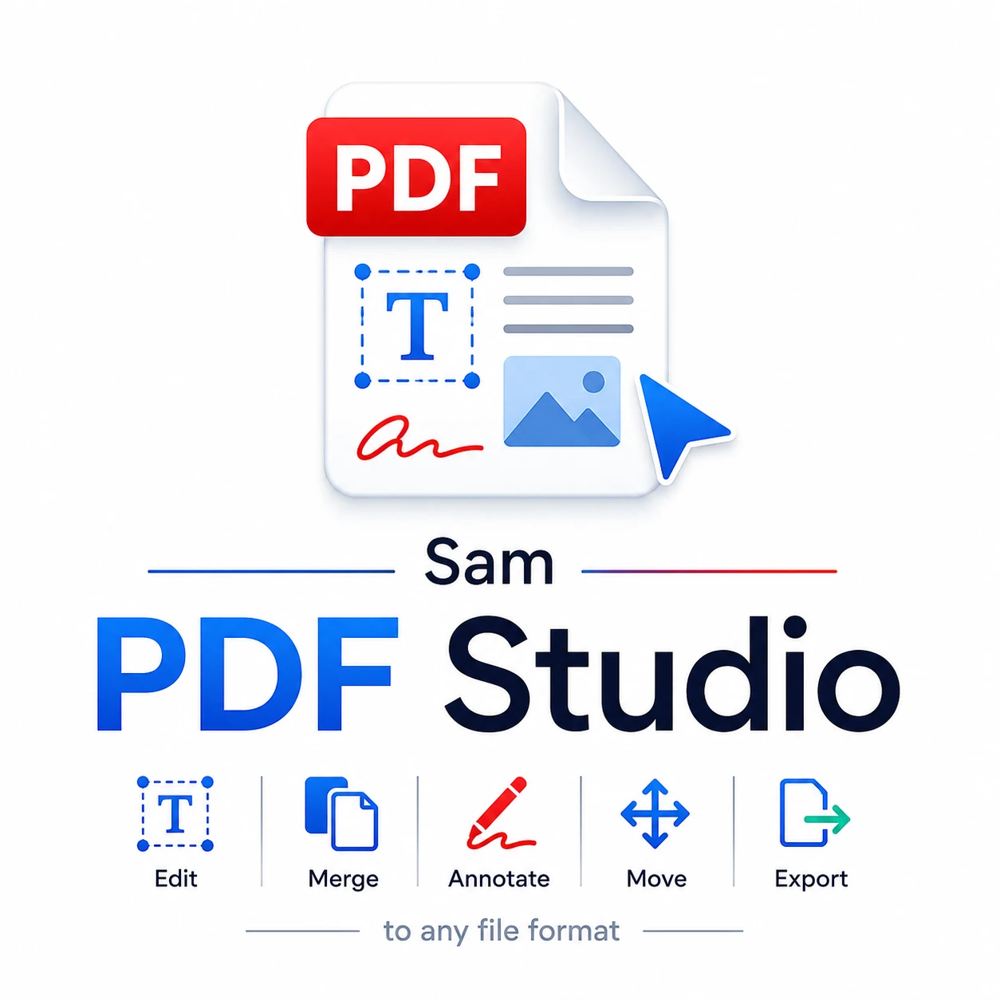
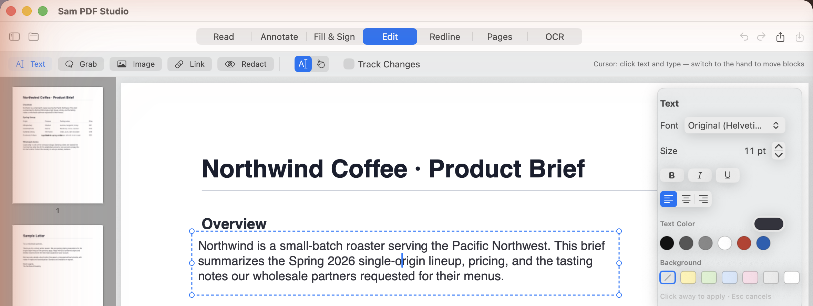
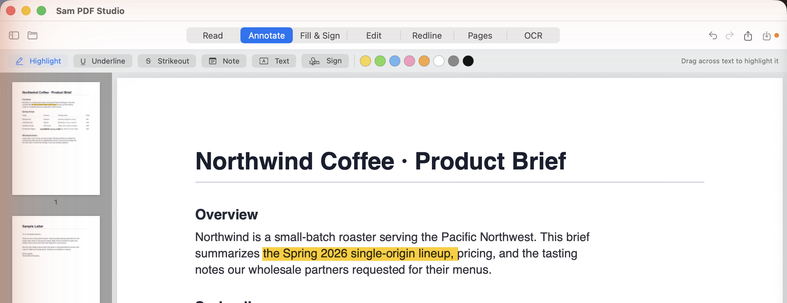
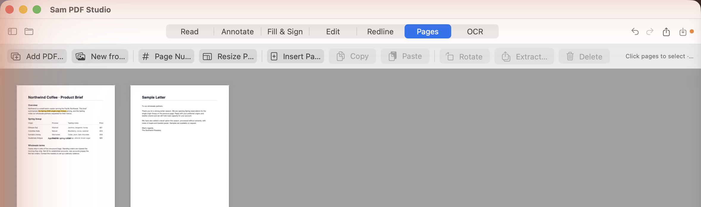

<p align="center">
  
</p>

# Sam PDF Studio

A native macOS PDF editor with a direct, tactile working feel: click the page and it happens — no coordinates, no forms, no output-folder litter. A SwiftUI/PDFKit front end drives a local PDF engine, so every document stays on your Mac.



## Features

- **Edit text in place** — click a paragraph and it becomes a live box you type into: multi-line, matching the document's own font, size, and color. Change the font to **any family in your font library**, adjust size, and set **bold**, *italic*, underline, and alignment (left / center / right), plus text color and a highlight/background color. Drag the box's dashed frame to move the whole block — alignment guides snap the moved content's bottom edge onto the line below, so it lands exactly where you drop it.
- **Annotate** — drag across text to highlight, underline, or strike through instantly, in any of eight colors (now including white, grey, and black). Drop sticky notes, type a text box anywhere on the page, or stamp a signature.



- **Signatures** — draw your signature with the trackpad, *or* type your name and pick a cursive style. Saved signatures live in a reusable gallery and stamp onto the page as clean transparent images.
- **Fill & Sign** — click to type text, stamp checkmarks / crosses / dots, stamp today's date, or drop your active signature.
- **Pages** — a thumbnail grid: click to select, drag to reorder, rotate / extract / delete, append other PDFs, add page numbers (position, style, start), resize every page to one uniform size (Letter / Legal / A4 / A5 — great after merging mixed sizes), or build a new PDF from images.



- **Merge & reduce size** — combine many files into one document (⇧⌘M), then drag pages to reorder; shrink a PDF at three quality levels with a before/after size readout.
- **Redline** — review marks: strikeout, squiggly underline, insert carets, replace-with-note suggestions, and margin notes.
- **OCR** — recognize all pages or just the current one; enhance scans (grayscale, denoise, contrast, sharpening).
- **Export** — Word, Excel, PowerPoint, Markdown, HTML, plain text, and page images.

Every change becomes a new version in a private session folder, so **Undo/Redo (⌘Z / ⇧⌘Z) walks real history** and your original file is only touched when you **Save (⌘S)**. Export a copy any time with the share button or ⇧⌘E.

## How it works

A native SwiftUI/PDFKit app fronts a local Python engine:

- **PDFKit** for viewing, instant annotations, and page management.
- **PyMuPDF** for text search, redaction-overlay replacement, text insertion, rendering, and export primitives.
- **pypdf** for reliable merge and page writing.
- **OCRmyPDF** with Tesseract, qpdf, and Ghostscript for searchable scanned PDFs.
- **pdf2docx** for first-pass PDF → Word conversion.
- **pymupdf4llm** for stronger Markdown export when available.
- **openpyxl** and **python-pptx** for first-pass Excel and PowerPoint exports.

## Build & run

```bash
git clone https://github.com/wassermanproductions/sam-pdf-studio.git
cd sam-pdf-studio
./script/build_and_run.sh
```

The first run creates the Python engine venv at
`~/Library/Application Support/SamPDFStudio/engine-venv`
(intentionally **outside** iCloud-synced folders — iCloud evicts venv files and makes Python imports hang). Swift build artifacts live in `~/Library/Caches/SamPDFStudio/build` for the same reason.

OCR system tools come from Homebrew:

```bash
brew install qpdf tesseract ghostscript poppler
```

## QA

```bash
./script/qa.sh
```

The harness verifies:

- engine health and Swift build
- DocumentSession version-stack semantics (undo/redo/branch/save edge cases)
- UI behavior invariants (reader purity, tool gating, redact isolation, transparent inline editor, version-stack routing)
- all engine PDF operations: merge, split, extract, delete, rotate, crop, replace text, add/annotate text, redact, notes, signatures, images, links, region paste/move, image/text/Markdown/HTML/DOCX/XLSX/PPTX export, images-to-PDF, OCR (full and current-page), and scan enhancement

QA scratch files land in `tmp/pdfs/qa`.

## Editing model

PDFs do not behave like Word documents internally. The app uses the practical strategy common to non-Adobe editors: locate visible text, redact the old glyphs, then write replacement text into the same region. This works well for forms, invoices, drafts, labels, and quick corrections. Deep reflow of arbitrary PDF content is a much harder class of editor — for that, export to Word, edit, and re-export.

## Agent control (MCP)

Any MCP agent — **Hermes, Claude Code, Codex, or any other MCP client** — can drive the PDF engine **headlessly** (no GUI): merge, split, redact, add text, OCR, convert, and page operations, all on local file paths. The server lives in [`mcp/`](mcp/) here and is also published standalone as [**sam-pdf-studio-mcp**](https://github.com/wassermanproductions/sam-pdf-studio-mcp).

```bash
# Claude Code
claude mcp add sam-pdf-studio -- node /absolute/path/to/SamPDFStudio/mcp/sam-pdf-studio-mcp.mjs
```

It shells out to the same bundled PyMuPDF engine the app uses, so file paths go in and new file paths come out — inputs are never modified in place. See [`mcp/README.md`](mcp/README.md) for the full tool list and Hermes/Codex/generic setup.

## License & credits

**Apache License 2.0** — see [LICENSE](LICENSE). Free to use, modify, fork, and build on, commercially or otherwise.

**Attribution required:** per the [NOTICE](NOTICE) file (Apache 2.0 §4(d)), any use, fork, or redistribution must retain the NOTICE file and credit **Sam Wasserman ([wassermanproductions.com](https://wassermanproductions.com))** in its documentation and about/credits surface.

Created by **Sam Wasserman** — [wassermanproductions.com](https://wassermanproductions.com) · [wasserman.ai](https://wasserman.ai).
